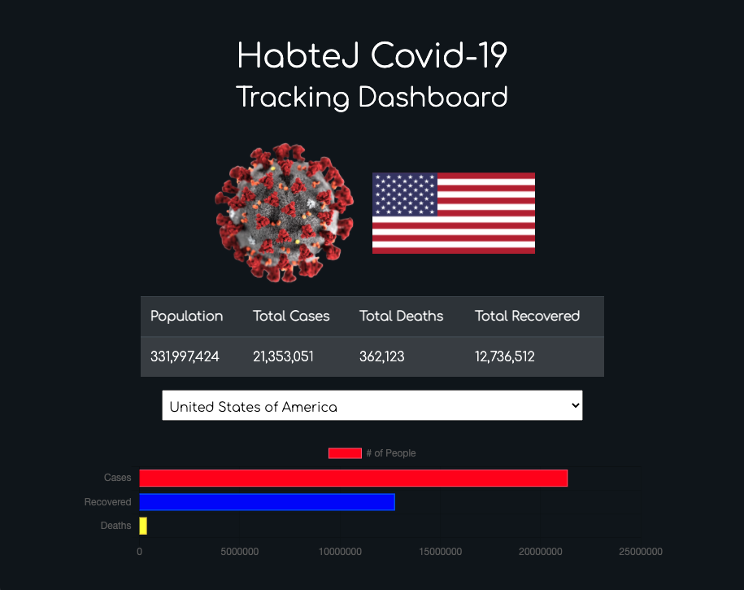

# HabteJ Covid-19 Tracking Dashboard

## `About`

- This application will allow the user to search for and display Covid-19 case data on a responsive and visually appealing user interface.
- Technologies used to create this application include React, Bootstrap, React Chart & Chart JS, Axios, and the Disease.sh API for disease statistics.

## `How to use`

- You can access this application at the following [link](https://habtej-covid-tracker.netlify.app).
- In order to run this application on your machine, clone this repo and run 'npm install' from the root project directory in order to install necesary packages and dependencies. Then, simply run 'npm start'.
- The application will display USA data by default. To view another country's data, click on the dropdown menu and select the country that you are interested in.

## `License`

